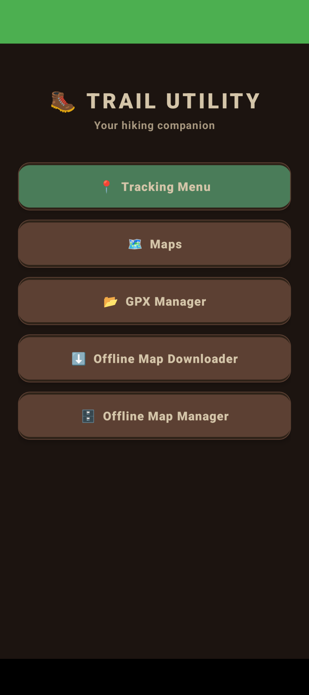
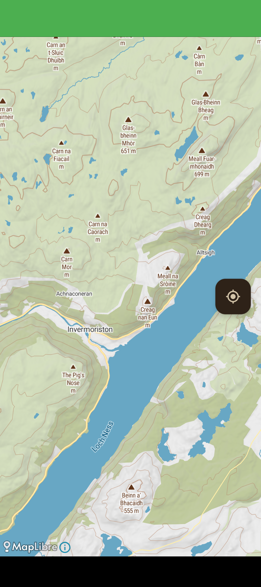

# 🥾 Hiking Utility App

An Android hiking companion app providing GPS tracking, GPX route management, and offline map support — powered by **MapLibre** and **MapTiler**.

---

## 🚀 Features

- **Live GPS Tracking:** Record distance, time, and pace in real-time.
- **Interactive Maps:** View routes and your position with MapLibre.
- **GPX Support:** Import/export GPX files for hikes or trails.
- **Offline Maps:** Download and manage maps for areas without internet.
- **Rugged UI:** Earthy toned design built for the outdoors.

---

## 📱 Screenshots

  
  
  
  

---

## ⚙️ Setup & Installation

1. **Clone the Repository**
   \`\`\`bash
   git clone https://github.com/boothy91/HikingUtility.git
   cd HikingUtility
   \`\`\`

2. **Open in Android Studio**
   File → Open → Select this project folder.

3. **Add Your MapTiler API Key**
   \`\`\`java
   // MapActivity.java
   private static final String MAPTILER_KEY = "******";

   // OfflineMapDownloader.java
   private static final String MAPTILER_KEY = "******";
   \`\`\`
   Get your free key at [cloud.maptiler.com](https://cloud.maptiler.com/).

4. **Run the App**
   Connect your device or emulator, then click ▶️ Run.

---

## 📜 Permissions

- \`ACCESS_FINE_LOCATION\` — precise GPS tracking
- \`ACCESS_COARSE_LOCATION\` — approximate location access

Grant these permissions when prompted on first launch.

---

## 🧭 Offline Maps

Use the **Offline Map Downloader** to save the current visible map region for use without internet. Manage or delete saved regions via the **Offline Map Manager**.

---

## 🧰 Tech Stack

- Java (Android)
- MapLibre SDK
- MapTiler Maps API
- GPX XML Parsing
- Android Services & Permissions
- Material Design 3

---

## 👤 Author

**Boothy91**
Built with ❤️ for hikers, explorers, and Android developers.
[MapLibre](https://maplibre.org) | [MapTiler Docs](https://docs.maptiler.com)
